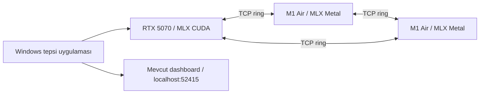

# EXO Windows uygulama raporu

Bu çalışma native Windows CUDA düğümünü ve ayrı Windows masaüstü uygulamasını
geliştirir. Varsayılan API ve dashboard portu **52415** olarak korunur. Hedef donanım
RTX 5070 ve iki adet 8 GB M1 MacBook Air A2337'dir. İlk karma küme yolu pipeline
parallelism ve TCP ring'dir. Tam fiziksel Mac/Windows matrisi ve temiz Windows kurulum kabulü
tamamlanmadan kararlı sürüm yayımlanmamalıdır.

**10 Ekim görünüm ve bellek devamı:** Windows paneli Mac kaynaklarının 340 px
düzenine, 640×560 ayarlar penceresine, açık/koyu AppKit renk değerlerine ve
orijinal siyah/sarı EXO simgesine uyarlandı. Topolojide yerel cihaz kökte,
diğer cihazlar Mac'teki yay düzeninde gösterilir; durdurulmuş panel küme ve
dashboard alanlarını gizler. Beş ayar sekmesi gruplu form düzenini kullanır.
Swift kaynakları değiştirilmedi. Tarayıcı UI kontrolleri native WebView/DPI
kabulünün yerine geçmez; güncel native tekrar ve yeni kurucu ayrıca beklenir.

Model oluşturma hatasında aynı görünen `8.3GB` değerleri yuvarlamadan
kaynaklanıyordu. API artık GiB, tam bayt ve eksik MiB/bayt miktarını verir;
kapasite sınırı gevşetilmedi. Bir bayt eksik, gerçek yakın sınır ve tam eşit
kapasite regresyonlarıyla birlikte **668 Python testi geçti**, 8 atlandı,
190 slow dışlandı; tip ve Ruff kontrolleri temizdir. Önceki frozen runtime
bu yeni API metnini içermez; yeni paket kendi kimliğiyle doğrulanmalıdır.

Claude'un `21a54c5e..931e0ff4` aralığındaki 26 commit/37 dosyası bağımsız
olarak incelendi; ayrıntılar [eski çalışma incelemesinde](windows-claude-baseline-review.md).
Windows dashboard yerleştirme testlerinin dokuzu ve üretim derlemesi geçti.
Dashboard tip kontrolündeki 15 hata/6 uyarı aynı bağımlılıkla eski `931e0ff4`
snapshot'ında da bulunuyor; bu kontrol yeşil gösterilmez. Güncel win.3 wheel
yalnız RTX 5070 hedefi için `120a-real;120-virtual` içerir. MLX socket retry
kaynak sızıntısı ayrı wheel yeniden derleme/doğrulama gerektiren P2 takibidir.

**10 Ekim native pencere devamı:** Aşağıdaki adayın gerçek Settings penceresi
klavye ile açıldığında boş kaldı; native ayar açma kabulü başarısızdır.
Kullanılan Tauri 2.12.2, Windows'ta senkron komut ve menü işleyicisinden
WebView oluşturmanın kilitlendiğini kaynak belgelerinde açıklar. Windows'a
özel iki çağrı async akışa taşındı; oluşturma/reuse mutex ile sıralanır ve
blocking builder ayrı thread'de çalışır. Yeni paket ve native tekrar kabulü
tamamlanana kadar önceki adayı tamamlanmış masaüstü olarak değerlendirmeyin.
Kanıt: `build/acceptance/Türkçe 安装 🙂/native-keyboard-installed/`.

Önceki **imzasız inceleme adayı** yerel kurulum ve süreç kabulünü geçti:
`build/acceptance/installers/EXO-Windows-health-handle-final.exe`.
RTX 5070 + tek M1 için iki master düzeni ve koordineli Windows stop; kurulu
GUI'de 52415/CUDA/çift açılış/gerçek sohbet/çökme sonrası süreç temizliği;
Unicode kurulum, restart, düzgün stop ve modelleri koruyan kaldırma doğrulandı.
665 Python testi geçti, 8 atlandı, 190 slow dışlandı. İkinci M1/üç cihaz,
temiz Windows, native DPI/klavye, imzalı güncelleme ve repo güvenlik denetimi
tamamlanmadı. Tüm plan veya kararlı yayın tamamlandı iddiası yoktur.

## Mac Xcode sonrası kabul çalışması — 10 Ekim 2026

### Mac-master denemesi ve Windows CUDA probe temizliği

`mixed-model-mac-master-20261010/` fiziksel denemesi model başlamadan
**başarısız oldu**: Mac master seçilirken Windows worker iptal edildi; CUDA
sağlık kontrolünün parent sürecini psutil ile yeniden açıp öldürme girişimi
`AccessDenied` verdi ve Windows node exit 1 ile kapandı. Başarısız kayıt korunur.

Windows probe artık parent için oluşturulmuş `Popen` handle'ını kullanır.
Alt süreç keşfi veya kapatılması hata verse bile dış `finally` parent kill/reap
işlemini çalıştırır; alt süreç erişim hatası sessizce başarıya çevrilmez.
İki gerçek süreç testi önce bu hataları gösterdi, düzeltmeden sonra geçti.
Hedefli **23 test**, tam CI import moduyla **665 geçti, 8 atlandı, 190 slow
dışlandı**. Windows tam ve seçili Darwin tip kontrolleri 0 hata/uyarı;
Ruff lint ve biçim kontrolü temizdir. Bu kaynak kontrolleri yeni frozen runtime
ve Mac-master fiziksel kabulünün yerine geçmez.

İzole Mac checkout'undaki eski health testinin hash'i eşleşmediğinde ilk sync
hiçbir dosya yazmadan durdu. Kaynak farkı ve eski içerik ayrıca arşivlenip
incelendikten sonra yalnız iki health dosyası güncellendi. Mac regresyonu
**43 geçti, 6 Windows-only atlandı**; Swift diff'i boş ve MLX kaynak kimliği
değişmedi. Mac'in mevcut EXO kurulumu bu işlemde kullanılmadı.

`health-handle-final-runtime-build-20261010.log` bu son kaynakların runtime
derlemesidir. Önceki kısa runtime denemesi ve `cluster-shutdown-fixed` NSIS
denemesi güncel kaynakları içermediğinden kimlikleri doğrulanarak iptal edildi;
başarılı paket veya dağıtım sayılmaz. Yeni native kapılar, iki master düzeni ve
kurulmuş güncel kurucu için tamamlanan kabul sonuçları aşağıda ayrı kaydedilir.

Bu rebuild tamamlandı: engine
`e3e29f50ca6aee003bd65a1f7ec9f56d3abff287324a0f801d154f9f320d004f`,
manifest `391354c8e8a8c830528ba6c0b93ddd68bc00b9cbc45bf9a187a207d8ec15d035`.
32 native kapı geçti; 31 log ve bir CPU ölçümü
`health-handle-final-runtime-gates-20261010/` altında hash'leriyle saklandı.
Gerçek safetensors testi 3.093.767.283 bayt ve 1.219 tensor yükledi.

`mixed-model-mac-master-health-fixed-20261010/mixed-model.json`
**başarılıdır**: Mac-master rolü loglarla doğrulandı, aynı iki rank üzerinde üç
sohbet tamamlandı, instance ve runners temizlendi, iki worker ve iki ana süreç
exit 0 verdi. Zorla sonlandırma yoktur; on ortak kaynak hash'i eşleşmiş ve
Windows runtime bütünlüğü ayrıca doğrulanmıştır. Bu kabul güncel engine'e
aittir; ikinci M1 veya üç cihaz kapsamını tamamlamaz.

Aynı engine ile `mixed-model-windows-master-health-fixed-20261010/` ve
`mixed-model-windows-stop-health-fixed-20261010/` de **başarılıdır**: üçer sohbet,
iki worker/root exit 0, zorla cleanup yok. Doğrudan Windows stop testinde Mac
survivor API'sindeki instance/runners da boşalmıştır. Instance-delete testinin
logunda, zaten kaldırılmış instance için ikinci DeleteInstance komutunun mevcut
master doğrulamasında `not found` uyarısı vardır; komut işlemcisi bunu yakalamış
ve iki rank normal kapanmıştır. Log saklanır; test hatasız log garantisi vermez.

Son kurucu işi `health-handle-final-installer-build-20261010.log` altında bu
güncel engine'i paketledi; eski kurulum/kaldırma sonuçları yeni kurucuya
aktarılmaz. İmza anahtarı bulunmadığından bu yerel inceleme paketi imzasızdır
ve signed updater kabulü tamamlanmış değildir.

Güncel frozen runtime ile `vision-health-handle-final-20261010/` Qwen3-VL-4B
gerçek görsel sohbeti, `image-edit-health-handle-final-20261010/` ise 512×512
Schnell üretimi/düzenlemesi/partial sonrası iptal/toparlanmayı geçti. İki farklı
giriş farklı final PNG verdi; aynı giriş/seed ile düzenleme iptalinden sonraki
final PNG hash'i ilk düzenlemeyle aynıdır. Worker/root exit 0; forced cleanup
yoktur. Rapor ve PNG hash'leri
`health-handle-final-vision-image-20261010.json` içindedir. Görüntü kapsamı tek
Windows CUDA rank'ında maskesiz Schnell img2img'dir; karma image kabulü değildir.

Paketlenen staged runtime ile gerçek Windows Job Object denetleyici probe'u
başlatma 3,29 sn, restart 4,66 sn, stop 1,52 sn verdi. Restart-stop ve son stop
`graceful=true/exitCode=0`; CUDA bildirildi, yabancı port sahiplenilmedi, startup
registry değişmedi. `health-handle-staged-controller-20261010.log` bu ayrı
headless kabulüdür; tray/WebView oluşturmaz ve kurulmuş GUI testinin yerine geçmez.
Görsel/model testlerinden sonraki 11.440 dosyalık runtime bütünlüğü de geçti.

NSIS build başarıyla tamamlandı. Güncel inceleme kurucusu
`build/acceptance/installers/EXO-Windows-health-handle-final.exe`,
1.795.226.258 bayt; SHA-256
`55b14fc6b77cf73bd269887622d09a6d60994a5b177fcec1acc44bc292cc06b1`.
Authenticode `NotSigned`; releaseReady false. Arşiv kopyasının hash'i eşleşti.
Ayrı `Türkçe 安装 🙂/shutdown-fixed-installed` dizininde kurulu GUI/GPU/lifecycle
kabulü **başarılıdır**. Kurulu engine ve manifest hash'leri fiziksel küme adayıyla
birebir eşleşti. Varsayılan 52415 ve MlxCuda, uygulama içindeki sabit WebView2,
tek GUI'ye ikinci açılış devri doğrulandı. Gerçek sohbetten sonra yalnız test
GUI'si çökertildi: iki sahip olunan engine/worker 2,16 sn'de kapandı, API kapandı.

Kurulu runtime'ın headless denetleyici kabulü start 3,17 sn, restart 4,62 sn,
stop 1,50 sn; iki stop graceful/exit 0. ZIP'ten çıkarılan hash'li kabul kiti
Windows PowerShell 5.1 ile 17 native kapıyı, gerçek 3 GB safetensors IO'yu,
Qwen sohbetini, **1.222 prompt token** prefill'i ve stream iptal/toparlanmayı
geçti. 16 süreç log'u ve bir CPU ölçümü korunur; son 11.440 dosyalık bütünlük
kontrolü geçti. Geliştirici makinesi override'ı açıktır; temiz Windows kabulü
false kalır. Bu prefill sonucu modelin azami context kabulü değildir.

Sahipliği doğrulanmış test kaldırması 24,45 sn'de geçti; model ve ayar hash'leri
korundu, dış modeller kaldı, uygulama/runtime/WebView2 kaldırıldı. Yalnız test
yolunu içeren kalan registry anahtarı ayrıca kimliği doğrulanarak temizlendi.
Test engine/GUI süreci kalmadı. Güncel kimlik ve bağımsız kapsamlar
`build/acceptance/installers/health-handle-final-candidate.json` içindedir.

### İki cihazlı sohbet ve koordineli kapanış kabulü

Son frozen engine
`d29ffaf9d3aa450f8fffe772d1ea8c47997721c53e546fd202664dcabdb1f087`
için `mixed-model-windows-node-stop-fixed-20261010/mixed-model.json`
**başarılıdır**: üç sohbet, doğrudan Windows shutdown event'i, Mac survivor
API'sinde instance/runners boş, Windows ve Mac worker'ları exit 0, iki ana
süreç exit 0; zorla cleanup yoktur. İki cihazda on kritik ortak kaynak hash'i
eşleşmiştir. Bu kabul önceki Mac -15 sonucunun üstüne yazılmamış; ayrı rapordadır.
32 native kapı/31 süreç log'u ve bir CPU ölçümü
`cluster-shutdown-fixed-runtime-gates-20261010/` altında korunur. Manifest hash'i
`cb7089370678f9affddba8549fa1f3392909393b7c239f5757f75e7b96fb09fa`.
Son tam regresyon **663 geçti, 8 atlandı, 190 slow dışlandı**; Windows tam ve
seçili Darwin tip kontrolü 0/0, lint/format temiz; Mac 29 geçti, 2 Windows-only
atlandı. Bu tek küçük model/Windows-master testidir; aktif uzun üretim sırasında
durdurma veya ani peer kaybının bütün davranışlarını kabul etmez.

Ara engine `4cbe195f...` için başlatılan NSIS sıkıştırması yeni Node kapanış
düzeltmesi sonrasında kimliği doğrulanarak durdurulmuştur. Bu işlem başarılı
kurucu kabulü değildir; eski hash'i doğrulanmış modal kurucu arşivde korunur.
Bu engine ile başlatılan `cluster-shutdown-fixed-installer-build-20261010.log`
paketleme işi de sonraki CUDA health düzeltmesi nedeniyle iptal edilmiştir.
Yeni kurucu ve onun kurulmuş runtime kabulü
tamamlanmadan önceki kurulum sonuçları bu engine'e aktarılmaz.

Son engine `4cbe195f...` için `mixed-model-close-result-fixed-20261010` fiziksel
tekrarı da üç sohbet/API temizliği/iki worker 0/iki ana süreç 0 kabulünü geçti.
Buna karşılık `mixed-model-windows-node-stop-20261010` doğrudan Windows düğümü
durdurma kabulü **başarısızdır**: Windows worker/root 0, Mac yeni master olarak
durumu temizledi, ancak Mac worker -15 verdi. Log sırası peer expiry, master
promotion ve mevcut worker iptalidir. Bu sonuç koordineli DeleteInstance
başarısıyla örtülmez.

Windows-only düğüm kapanışına bu nedenle önce mevcut `DeleteInstance`
komutlarını gönderme ve yalnız bu düğümün kullandığı instance/rank kimliklerinin
kapanmasını bekleme eklendi. Mevcut 8,5 saniyelik global deadline korunur;
Mac node-stop/election kodu değişmez. Creation lock sonrasında runner snapshot'ı
alınır, aynı instance yalnız bir kez silinir, diğer instance'lar korunur. Komut
kanalı kapanmışsa yerel closer'lar yine çalışır ve hata loglanır. İki gerçek
failing test bu eksik davranışları gösterdi; ilgili dokuz test geçti. Son Mac
ortak regresyonu 29 geçti, 2 Windows-only atlandı; tam Windows ve seçili Darwin
tip kontrolleri temiz. Frozen rebuild ve fiziksel direct-stop tekrarının kabulü
tamamlanmadan bu yeni akış başarılı sayılmaz. Global RunnerShutdown yayını
process exit'ten önce olabilir; fiziksel rapor iki worker'ın gerçek 0 çıkışını
ayrıca kontrol eder.

Windows instance kaldırma yolu artık mevcut Windows cooperative closer'ı
kullanır ve worker kapanışı bitene kadar runner sahipliğini tutar. Aynı runner
için eşzamanlı node-stop çağrısı aynı kapanışın bitmesini bekler. Mac'in erken
runner kaldırma ve 3 saniyelik yolu korunmuştur. Kapanış yardımcısı yalnız gerçek
süreç çıkışı 0 olduğunda başarı döndürür; timeout/hata/nonzero sonucunda planner
mevcut `TimedOut` olayını yayımlar. Dış iptal yutulmaz. Salt okunur alt ajan
incelemesi bu son değişiklikte yeni race/deadlock veya yanlış başarı bulmadı.

Önceki `mixed-model-shutdown-fixed-20261010` denemesinde üç sohbet ve API
temizliği geçti, Mac worker exit 0 verdi; Windows worker -15 olduğu için genel
kabul başarısız kaldı. Ownership düzeltmesinden sonraki ilk tekrar
`mixed-model-instance-close-fixed-20261010` model başlamadan test portunda
WinError 10013 verdi. Bağlantı tablosu 61920'nin başka uygulamanın outbound
bağlantısında kullanıldığını gösterdi; bu kayıt başarısız olarak korunur.

`mixed-model-instance-close-fixed-staticports-20261010/mixed-model.json`
**başarılıdır**: iki gerçek CUDA/Metal rank, aynı 11 model/tokenizer dosyası,
üç sabit sohbet, instance/runners API durumunun boşalması, iki worker ve iki
ana süreç için çıkış 0. Zorla sonlandırma yoktur. İki cihazda karşılaştırılan
dokuz ortak kaynak hash'i ve Windows 11.440 dosyalık runtime bütünlüğü raporda
vardır. Bu kayıt engine SHA-256
`24d6d097db6a0f7f5a2698427d29a61ce402c665a6bd781a248b567fec2f2e89`
içindir; sonraki hata sonucu düzeltmesine otomatik aktarılmaz. Test portları
42820/42822/42823/42824'tür; ürünün varsayılanı **52415** değişmemiştir.

Son timeout düzeltmesinde gerçek failing test, Windows planner'ın `TimedOut`
olayı vermediğini gösterdi; Mac karşılığı geçti. İlgili Windows testleri
**26 geçti**, tam CI import moduyla **661 geçti, 8 atlandı, 190 slow dışlandı**.
Windows tam tip kontrolü ve seçili Darwin tip kontrolü 0 hata/uyarı, değişen
dosyalarda Ruff lint/format temiz. Fiziksel Mac'te **24 geçti, 2 Windows-only
test atlandı**; Swift diff'i ve MLX kaynak kimliği korunmuştur. İlk sandbox
test denemesi geçici dizin oluşturma hatası nedeniyle kabul sayılmaz; native
tekrarlar ayrı kaydedilmiştir. Dış iptal ve nonzero closer çıkışı ayrıca
regresyon testinde zorlanmamıştır.

Kanıtlar: `windows-instance-close-full-suite.log`,
`mac-instance-close-sync-20261010.log`, `windows-close-result-planner-red.log`,
`windows-close-result-green.log`, `windows-close-result-full-suite.log`,
`windows-close-result-types.log`, `windows-close-result-darwin-types.log`,
`mac-close-result-sync-20261010.log`. Yeni timeout sonucu içeren runtime
derlemesi ve fiziksel kabul tekrarının sonucu aşağıdaki eski adaya ait
kayıtlardan ayrı tutulacaktır. Mevcut NSIS kurucusunun eski engine kabulü bu
yeni runtime için geçerli sayılmaz.

Bu koordineli instance kaldırma testi doğrudan master/node-stop, ani peer
kaybı, uzun context, ters model/master sırası, ikinci Mac/üç cihaz veya tam
Mac-only model regresyonunu doğrulamaz. Temiz Windows ve gerçek kaynak
güvenlik denetimi de tamamlanmamıştır; kararlı yayın kabulü false kalır.

Mac-only gerçek karşılaştırması
`mac-only-baseline-comparison-20261010/comparison.json` içindedir. Onaylı Git
baseline'ı ayrı dizine arşivlenmiş, güncel ortak kaynaklarla aynı sabit MLX ve
model üzerinden çalıştırılmıştır. İki sabit yanıtta içerikler birebir aynıdır:
hello ve four. İki ana süreç exit 0 verir; doğrudan node-stop sırasında hem
baseline hem fork Mac worker'ı -15 verir. Mevcut Mac davranışı bu kapsamda
aynıdır; normal worker kapanışı kabulü false kalır. Deney prototipinin remote
regex kaçışı ilk raporda doğru yanıtları false etiketlemişti; gerçek saklanan
yanıtlardan prompt kontrolü düzeltilmiş, ilk rapor ayrı korunmuştur. Mevcut
Mac uygulamasına dokunulmamıştır; bu tek model karşılaştırması bütün Mac
uyumluluk matrisini doğrulamaz.

Son hata sonucu düzeltmesini içeren frozen runtime build'i tamamlanmıştır:
32 native kapı, gerçek 3.093.767.283 bayt safetensors yükleme, 31 süreç log'u
ve bir stalled-peer CPU ölçümü korunur. Engine SHA-256
`4cbe195f3dd49f732c86fe39496f3f2854255b2583f693a8edb5e22cc6e9cb9d`,
manifest SHA-256
`7402687297f62c46d62fcb3f2837de6bdf35e81860998253723bbd91e0f1050b`.
Kanıt: `close-result-fixed-runtime-gates-20261010/identity.json`.
Bu engine'in fiziksel tekrar ve kurulum kabulü ayrıca kaydedilecektir.

### Ortak kapanış olayının iletilmesi

Fiziksel model denemesindeki iki `ShuttingDown` kaydı için iki yarış doğrulandı:
worker, Shutdown görevinin alındığı onayından sonra supervisor'ı iptal ediyor;
child event sender'ın kapanması da kuyruktaki son olayı paylaşılan `closed`
bayrağı nedeniyle okunamaz hâle getirebiliyor. Supervisor artık yalnız son
`RunnerShutdown` olayının event router'a iletimi tamamlandıktan sonra Shutdown
çağrısını döndürür. Mevcut 3/8 saniye sınırları korunur. Runner event çıkışı için
isteğe bağlı graceful FIFO EOF kullanılır; diğer kanalların varsayılan abort
kapanışı korunur. Ortak Python'daki bu düzeltme Swift/Metal/JACCL veya MLX
kaynak pin'ini değiştirmez.

Regresyonun ilk red kaydı ack sonrası erken dönüşü iki kez, ayrı IPC red kaydı
graceful kapanış eksikliğini bir kez gösterir. İlgili 20 test Windows'ta geçti;
aynı 20 test fiziksel Mac'te 9,90 saniyede geçti. Beş Python/test dosyası Mac'in
izole checkout'unda eski Windows manifest hash'leri doğrulanarak yedeklendi ve
güncellendi. Mac MLX yine `0.32.0.dev20261010+cc3f3e60` ve aynı tam kaynak
commit'indedir. İnceleme, son EOF düzeltmesinde yeni yarış veya deadlock bulmadı.

Windows tam pytest çalışması varsayılan import modunda sekiz download testini
`tests` paket adlarının çakışması nedeniyle toplayamadı: cancel_download,
download_status_not_lost, download_verification, model_dirs, offline_mode,
rate_limit_handling, re_download ve safetensors_index. Mevcut CI'nin de kullandığı
`--import-mode=importlib` ile son tam çalışma **655 geçti, 8 atlandı, 190 slow
test dışlandı**; tip, lint ve biçim kontrolleri temiz. Bu sayılar atlanan testleri
veya gerçek donanım matrisini başarılı saymaz.

Kanıtlar: `shutdown-final-event-red-corrected.log`, `shutdown-event-eof-red.log`,
`shutdown-final-event-eof-green.log`, `shutdown-final-event-eof-full-suite.log`,
`shutdown-final-event-eof-types.log`, `mac-shutdown-final-event-sync-20261010-retry.log`.
Yeni frozen Windows runtime build'i ve fiziksel model tekrar kabulü aşağıdaki
eski aday kayıtlarından ayrı tutulur; tamamlanmadan başarılı ilan edilmez.

### Derleme ve önceki fiziksel kabul kayıtları

Fiziksel Mac'te macOS 27.0.1 (26A434), Xcode 27.0 (27A266a) ve ilk açılış
kontrolü doğrulandı. Eksik resmi Metal Toolchain indirildi. Buna rağmen sabit
MLX `cc3f3e60be1289506125f2fa19b73b05aa770df8` kaynağı yeni Metal 32023.921 ile
derlenemedi: NAX shader'ında adres alanı, `fence.metal` içinde dahili atomic
fonksiyonun argüman sayısı değişmiş. macOS 26.2 derleme hedefi ilk hatayı aşsa da
ikinci hata devam etti. Mac Metal kaynakları veya dependency pin'i değiştirilmedi.

Apple'ın resmi `xcodebuild -downloadComponent MetalToolchain -exportPath ...
-buildVersion 17F109` komutuyla eski Metal 32023.883 bileşeni ayrı test dizinine
export edildi; DMG salt okunur bağlandı. Aynı iki shader aynı SHA-256 değerleriyle
bu derleyicide geçti. Genel Xcode seçimi ve güncel kurulu Metal bileşeni korundu.
Test derlemesine özel `xcrun` seçicisi yalnız Metal araçlarını bu gerçek eski
binary'ye yönlendirir; diğer araçlar `/usr/bin/xcrun` kullanır. Tam MLX build'i
5 dakika 23 saniyede başarılı oldu; gerçek Metal sum sonucu `16.0`, ring
kullanılabilirliği true ve süreç çıkışı 0. Kaynak commit'i aynı kaldı. Build
tarihi nedeniyle sürüm etiketi `0.32.0.dev20261010+cc3f3e60` oldu; test aracı
artık tarih etiketinin yanında kurulu paketin `direct_url.json` içindeki tam
repo URL'sini ve 40 karakter commit kimliğini doğrular, rank öncesinde tekrar
kontrol eder. Bu değişiklikte 18 test, tip/lint/biçim kontrolü geçti.

Kanıtlar `build/acceptance/mac-metal-17F109-export-20261010.log`,
`mac-metal-17F109-shader-probe-20261010.log`, `mac-metal-17F109-selector.log` ve
`mac-pinned-mlx-metal17F109-sync-20261010.log` ve
`mac-pinned-mlx-metal17F109-gpu-probe.log` içindedir.
Önceki gerçek preflight `mixed-ring-xcode27-20261010-preflight/mixed-ring.json`
içinde MLX henüz kurulu olmadığı için başarısızdır; başarılı kabul sayılmaz.

Gerçek iki cihazlı ring kabulü `mixed-ring-metal17F109-20261010/mixed-ring.json`
içinde başarılıdır: Mac rank 0/Windows rank 1 ve ters sıra; FP32/FP16/BF16/int32,
4096 ve 2097153 eleman, all_sum/max/min/gather ile send/recv/strided işlemleri.
Native worker'ın kasıtlı başarılı test çıkışı 7, SSH denetleyici çıkışı 0'dır.
Bağımsız alt ajan incelemesi Windows timeout değişkeninin adını düzelttirdi:
`MLX_RING_IO_TIMEOUT_SECONDS=30`. Windows manifest/engine/wheel kimlikleri de
artık fiziksel raporda korunur. İlk başarılı ring kaydı bu son araç düzeltmeleri
öncesine aittir. Son araç ayarlarıyla `mixed-ring-reviewed-metal17F109-20261010`
denemesi SSH/peer bağlantı kaybıyla başarısız oldu; başarılı kabul sayılmadı.
Mac SSH erişimi daha sonra geri geldi. Kayıtlar bu kesintinin nedenini henüz
kanıtlamıyor; uyku kaynaklı olduğu varsayılmadı. Ardışık yeni deneme
`mixed-ring-reviewed-serial-20261010/mixed-ring.json` iki rank sırasında da
başarılıdır; dört rank çalışmasının tüm dtype/boyut sonuçları ve çıkış 7,
tam 11.440 dosya bütünlüğü ve Windows aday kimliği raporda doğrulandı.

İlk fiziksel Qwen3-0.6B pipeline modelinin üretim adımı geçti:
`build/acceptance/mixed-model-ready-root-new-ports-20261010/mixed-model.json`.
Model/tokenizer/config dosyalarının SHA-256 değerleri iki cihazda eşleşti;
world_size 2, Windows rank 0 katman 0–6 ve Mac rank 1 katman 6–28. Üç sohbet
isteğinde geçerli çıktı ve cache hit kayıtları alındı; 2+2 yanıtı dört oldu.
İki ana düğüm exit 0 ile kapandı, fakat Mac runner'ı normal kapanmadı ve
SIGTERM ile -15 çıkışı verdi. Bu nedenle genel kabul `passed=false`, üretim
`model_inference_verified=true` olarak düzeltildi. İlk, worker kapanışını
denetlemeyen rapor `initial-unchecked-worker-report.json` adıyla korundu.
Instance'ın iki rank'ta birlikte kaldırılmasıyla kapanış yeniden sınanacak;
bu test ana düğümün aniden kapanması veya ağ kopması kabulünün yerine geçmez.
İlk koordineli kaldırma denemesi (`mixed-model-coordinated-drain-20261010`)
Mac SSH bağlantısı zaman aşımına uğradığı için model aşamasına ulaşamadı.
Önceki deneyler başarısız kayıtlarıyla korunur: farklı API portları topoloji
oluşmasını engelledi; erken placement ve model kökü yerine model alt klasörü
verilmesi sonraki deneyi engelledi; hemen tekrar kullanılan macOS test portu
bir denemede Address already in use verdi. Son deney aynı API portunu iki
cihazda kullanır, iki yönlü topolojiyi bekler ve hazır modellerin üst kökünü
salt okunur tanımlar. Ürün varsayılanı 52415 değişmedi; yalnız bu deney 61520
kullanır. Deney aracı `build/acceptance` altında yerel prototiptir; henüz kalıcı
CI model kabul aracı değildir.

Koordineli kaldırma tekrarında (`mixed-model-drain-serial-20261010`) aynı iki
rank üç sohbeti üretti; instance kaldırıldıktan sonra Mac ve Windows worker'ları
exit 0 ile kapandı, ardından iki ana düğüm de exit 0 ile çıktı. Ancak API durumu
60 saniye içinde temizlenmediği için genel kabul yine false kaldı. Sıkıştırılmış
API event log'u `InstanceDeleted` ve iki `RunnerShuttingDown` içeriyor; iki
worker için son `RunnerShutdown` olayı bulunmuyor. Worker shutdown planı görevin
alındığı onayından sonra supervisor'ı iptal ediyor; son olayın iletilmesi ayrıca
beklenmiyor. Bu bulgu süreç çıkışı ile küme durumunun temizlenmesini ayrı
doğrulamak gerektiğini gösterir. İlk ana düğüm durdurma deneyindeki Mac -15
sorunu bu tekrar sayesinde çözülmüş sayılmaz. Son ring incelemesinde yanlış
provenance kabulü veya yanlış başarı raporlaması bulunmadı.

Bu kayıt tek Mac + RTX 5070, Windows master ve bir pipeline rank sırasını
doğrular. Ters model/master sırası, uzun context, gerçek karma iptal/toparlanma,
peer kopması, ikinci M1/üç düğüm, karma vision/image/tensor ve Mac-only baseline
model regresyonu tamamlanmış sayılmaz. Kararlı yayın kabulü false kalır.

Kullanıcının isteğiyle mac_compatibility, mlx_cluster ve windows_runtime alt
ajanları yeniden çalıştırıldı. Üçü de yerel salt okunur araç erişimini doğruladı
ve inceleme tamamladı; eski process setup hatasını bu oturumlarda tekrarlamadı.
Codex Security'nin eski deep scan kaydı ayrıca MCP üzerinden kontrol edildi:
aktif worker 0, kaynak kapsamı 0, 911 dosyanın hiçbirine dayanan sonuç yok.
Eski mühürlenmiş tarama başarılı güvenlik denetimi sayılamaz; bu ajan kontrolü
Codex Security SDK worker'larının yeniden tarandığı anlamına gelmez.

## Windows devam çalışması — 10 Ekim 2026

Windows panelindeki modal pencerelerde klavye odağı sınırlandı; ileri/geri Tab
geçişi, Escape ile yalnız ön pencerenin kapanması ve önceki düğmeye odak dönüşü
düzeltildi. Gerçek frozen state kaydıyla 13 Playwright ve 3 Vitest testi geçti;
Svelte kontrolü 0 hata/uyarı verdi ve UI production build tamamlandı.
100/125/150/200 yüzde piksel yoğunluğu testleri browser CSS/DOM testleridir;
native Windows monitör DPI ve erişilebilirlik kabulü olarak sayılmadı.

`scripts/windows/build-acceptance-kit.ps1` ayrı Python kurulumu gerektirmeyen bir
kabul ZIP'i üretir. Kit, kurulu `exo.exe` ile tam dosya bütünlüğü, GPU/JIT/spawn,
yerel ring, gerçek >2 GiB safetensors, sohbet, uzun context, iptal/toparlanma ve
normal worker kapanışını sınar. Yardımcı dosyalar manifest hash'leri doğrulanmadan
çalıştırılmaz. Windows Python mağaza kısayolları ile gerçek interpreter ayrılır;
belirsiz kısayollar geliştirici aracı sayılır. Bağımsız incelemedeki iki bulgu
düzeltildi; yeniden incelemede yeni bulgu çıkmadı. Windows araç testleri: 28 geçti.
Yeni test dosyasının tip kontrolü 0 hata/uyarı; Ruff lint ve biçim kontrolü geçti
(`build/windows-runtime/consumer-reviewed-types.log`, `consumer-reviewed-all-tools.log`).

Son ZIP: `build/acceptance/consumer-kit-reviewed-20261010/exo-windows-acceptance-kit.zip`,
SHA-256 `0d4dd5417036baa72be8fe3476d90d41d685172836e93432c4c4d72533213a76`.
ZIP'ten çıkarılan kit gerçek RTX 5070 üzerinde başarılı komut çıkışı 0 verdi:
`build/acceptance/compilerless-consumer-kit-reviewed-20261010/installed-runtime.json`.
Manifest doğrulandı; 11.440 dosya GPU/sohbet testinden önce ve sonra doğrulandı.
17 native gate kaydının 16 süreç log'u kabul dizinine hash'leriyle kopyalandı;
ayrı idle CPU ölçümünün süreç log'u yoktur. Sohbet/iptal/toparlanma ve worker
exit 0 geçti. PowerShell 5.1 ön kontrolü de son çıkarılmış kitte geçti.
Bu PC geliştirici araçları içerdiğinden açık `AllowDeveloperMachine` kullanıldı;
temiz Windows ve genel yayın kabulü false kalır. Kit manifest'i imzasızdır;
değişmiş/karışmış dosyaları algılar, yayıncı kimliğinin bağımsız kanıtı değildir.

Modal düzeltmeli NSIS paketi üretildi: **1.795.226.453 bayt**, SHA-256
`6498e5661e510ab530ab8291d2f724929cb41a66e12eddce31c17f49ebaf14a5`.
Dosya: `app/windows/src-tauri/target/release/bundle/nsis/EXO Windows_0.3.70_x64-setup.exe`.
Derleme kimliği: `build/acceptance/installers/modal-fixed-build-identity.json`.
İmza `NotSigned`; yayın kabulü false. Son kimlik/kapsam dosyası:
`build/acceptance/installers/modal-fixed-candidate.json`.
API varsayılanı 52415 ve Mac Swift/Metal/JACCL kaynakları korunur.

Yeni aday `build/acceptance/Türkçe 安装 🙂/modal-fixed-installed/` içine gerçek
kuruldu: 11.440 dosya ve sabit browser hash'i doğrulandı. Kurulan desktop SHA-256
`b9c93124d6918afbc8323970c6ef50c14d36d1ab7ff8557add4d449f5f64f87b`.
Runtime/browser override olmadan 52415'te CUDA açıldı; ikinci açılış tek sürece
bağlandı. Gerçek CUDA sohbetinden sonra yalnız test GUI'si öldürüldüğünde iki
engine/worker süreci 2,17 s içinde temizlendi ve API kapandı.
Mevcut ortak headless masaüstü denetleyicisi kurulu runtime'a karşı çalıştırıldı:
başlatma 2,62 s, restart 3,90 s, düzgün stop 1,30 s; kapanışlar exit 0.
Bu denetleyici testi native GUI/DPI kabulü değildir.

Üretimden sonra 11.440 dosyanın hash'i tekrar doğrulandı. Yalnız ayrı test
kurulumu 24,50 s içinde kaldırıldı; model işaret dosyası ve ayar hash'leri aynı
kaldı, harici modeller korundu. Kaldırılmış test dizinine işaret eden tek konum
kaydı sahiplik/kaldırma kontrolünden sonra temizlendi; kanıt
`install-location-cleanup.json` içindedir. Test programı kaldırıldı, kurulum EXE'si
duruyor. Aynı engine'in önceki vision/Schnell img2img kabul kayıtları ayrıca
saklanır; bu yeni GUI kurulumunda tekrar image/vision kabulü çalıştırılmadı.
Temiz fiziksel Windows, native monitör DPI/erişilebilirlik, imzalı güncelleme,
gerçek kaynak güvenlik taraması ve fiziksel Metal/CUDA küme kabulü tamamlanmadı.

## Önceki görüntü düzenleme adayı ve kabul kayıtları — 10 Ekim 2026

Görüntü düzenleme için gerçek RTX 5070 deneyi eski frozen runtime'da hata buldu:
aynı prompt/seed ile kırmızı ve mavi girişler birebir aynı PNG üretti.
`build/acceptance/image-edit-win3-frozen/inference.json` başarısız kabul kaydıdır.
API'nin mevcut `image_strength` değeri Windows diffusion ayarına aktarılacak
şekilde düzeltildi; Mac'te eski çağrı ve başlangıç timestep davranışı korundu.
Görüntü modülünde 46 test ve ortak Python/Windows araç kapsamında 636 test geçti
(8 atlandı, 190 yavaş test kapsam dışı). Gerçek kaynak CUDA testinde farklı giriş
çıktıları ve iptalden sonra aynı-seed toparlanması başarılı, worker exit 0:
`build/acceptance/image-edit-win3-source-fixed/inference.json`.
Yeni frozen runtime'ın 32 kapısı geçti; 11.440 dosyanın manifest'i doğrulandı.
Engine SHA-256:
`99d8a0aaddb0be70761bdff85075147ea7563b32ebc71b4f1aba2ce23c3a3693`.
Gerçek frozen img2img, iptal/toparlanma ve normal worker kapanışı da geçti:
`build/acceptance/image-edit-win3-fixed-frozen/inference.json`.
Kaynak ve frozen sürümlerin PNG'leri bu aynı Windows cihazında birebir eşleşti:
`build/acceptance/image-edit-source-frozen-comparison.json`; farklı backend'ler
arasında bit eşitliği varsayılmadı. Yeni frozen sohbet ve vision kayıtları
`chat-win3-edit-fixed-frozen/inference.json` ve
`vision-win3-edit-fixed-frozen/inference.json` (`build/acceptance`) altında.
Yeni runtime'ın headless masaüstü denetleyicisi de geçti: başlangıç 2,62 s,
restart 3,84 s, stop 1,31 s; iki kapanış düzgün ve exit 0, yabancı port sahiplenilmedi.
Kayıt: `build/windows-runtime/edit-fixed-desktop-probe.log`.
Bu kontrol native tepsi/WebView görsel kabulü değildir.
Schnell img2img kabulü maskeli düzenleme veya karma image pipeline kabulü sayılmaz.

Yeni kurulum adayı **1.795.223.432 bayt**, SHA-256:
`d825a31a5cba1ff3a3800983c0f3ac8d239de39491ef560ad0f5e3a0e8b362f1`.
Arşiv dosya: `build/acceptance/installers/EXO-Windows-img2img-before-modal-fix.exe`.
Kurulan desktop SHA-256:
`52041fccad380cea363751ce1f6477f873fd7b071c8e08db71973fa14ab77f80`.
Paket kimliği ve kabul kapsamı `build/acceptance/installers/edit-fixed-candidate.json`
içindedir; imzasız yerel inceleme adayıdır, `release_ready=false`.

`build/acceptance/Türkçe 安装 🙂/fixed-edit-installed/` altında gerçek kurulum,
11.440 dosya ve sabit Microsoft browser hash'i doğrulandı. Override olmadan
52415'te CUDA başladı, ikinci açılış ilk sürece bağlandı. Gerçek CUDA sohbeti
sonrası yalnız GUI öldürüldüğünde iki engine/worker süreci 2,14 s içinde kapandı.
Unicode kurulu runtime'da Schnell üretim/edits/iptal/toparlanma da geçti.
İlk denemede engine kabulü ve normal worker çıkışı başarılı olmasına rağmen
test aracının son mesajı CP1254 konsol kodlamasında Çince yolu yazamadı.
`-X utf8` ile yeni dizinde tam tekrar komut çıkışı 0 verdi:
`image-edit-utf8/inference.json`; CI `PYTHONUTF8=1` kullanacak şekilde düzenlendi.

Kurulu runtime'ın headless denetleyicisinde başlangıç 2,57 s, restart 3,85 s,
stop 1,29 s; kapanışlar düzgün ve exit 0. Üretim sonrası 11.440 hash tekrar
doğrulandı. Yalnız workspace test kurulumu kaldırıldı (23,92 s): exe/runtime/browser
ve uninstall kaydı silindi, model işaret dosyası ve ayar hash'leri aynı kaldı,
harici modeller korundu. Testin geride bıraktığı, kaldırılmış dizine işaret eden
tek kurulum konumu kaydı sahiplik kontrolüyle temizlendi. Test programı kaldırıldı;
kurulum EXE'si inceleme için duruyor. Bunlar geliştirme bilgisayarındaki testlerdir;
temiz Windows, imzalı güncelleme ve native görsel DPI/klavye kabulü bekler.

Devam oturumunda fiziksel Metal/CUDA ring denetleyicisi eklendi:
`scripts/windows/check_mixed_ring.py`. Kaynak ve sabit Mac MLX ön kontrolünden sonra
iki rank sırasını çalıştırır; zaman aşımı temizliğini kendi test süreçleriyle
sınırlar. 11 hedefli test ve tip/lint kontrolü geçti. Gerçek çalıştırmada
192.168.1.105'in SSH ve EXO API'si ulaşılamadı; kayıt
`build/acceptance/mixed-ring-20261010-preflight/mixed-ring.json` içinde
`passed=false`, `physical_ring_verified=false`, `model_inference_verified=false`.
Bu denetleyici kaynak/CI aracıdır; önceki kurulum adayının GPU kabulünü veya
fiziksel Mac küme kabulünü değiştirmez. Kullanım hardware acceptance belgesindedir.

Son Windows MLX adayı `0.32.3.dev20261009+win.3` olarak sabitlendi.
Wheel SHA-256:
`045831dade422768798c314e63d4a8324873d8b3f64c12097ba4a6d3841885b2`.
Kaynak patch SHA-256:
`15b57315406c4453956f1398bc3465cd7dd043575eb513dc9f419396fe28f779`.
Mac MLX `0.32.0.dev20260506+cc3f3e60` kaynak seçimi korunur.

## Önceki Win.3 / WebView2 adayının karşılaştırma kayıtları

Aşağıdaki kayıtlar yeni düzenleme düzeltmesinden önceki kabul tabanını gösterir.
Güncel aday ve testler yukarıda belirtilmiştir.

| Önceki doğrulama | Gerçek sonuç ve kanıt |
| --- | --- |
| Python regresyonu | `src` ve Windows paket testlerinde 618 geçti, 8 atlandı, 190 yavaş test kapsam dışı; ayrıca iki Rust/Python bağ testi geçti. Toplam 620 başarılı test: `python-regression-final-fixed-webview.log`, `python-rust-bindings-final.log` (`build/windows-runtime`). |
| Temiz CPU CI | Özel wheel, MLX ve NVIDIA paketleri olmayan ayrı checkout/venv'de 186 geçti, 6 atlandı; `build/windows-runtime/cpu-ci-final-fixed-webview.log`. |
| Hosted CI tip kurulumu | Yayınlanmamış wheel bulunmayan aynı kopyada inference kaynakları ve public MLX analiz modülü kuruldu; Windows/Darwin analizinde 262 kaynak ve 0 hata/uyarı: `cpu-ci-final-types-windows.json`, `cpu-ci-final-types-darwin.json` (`build/windows-runtime`). Bu analiz GPU kernel testi değildir. |
| Windows ve Darwin tip kontrolü | basedpyright iki platformda 0 hata/uyarı; Ruff ve 280 dosyanın biçim kontrolü geçti (`src`, Windows scripts/packaging, tools ve bench). |
| Windows Rust | 34 native/birim testi ve bütün hedeflerde Clippy `-D warnings` geçti; `desktop-final-native-tests.log`, `desktop-final-clippy.log` (`build/windows-runtime`). |
| Masaüstü arayüzü | 7 Playwright akışı ve 3 Vitest testi geçti; About kaynak commit/MLX sürümünü ve çalışma ağacı değişikliklerini bildirir. |
| Frozen CUDA runtime | 32 kapı geçti; `build/windows-runtime/win3-full-integrity-runtime-build-rerun.log`. |
| Unicode dizindeki aynı runtime | 32 kapı geçti; `build/windows-runtime/win3-unicode-immutable-gates.json`. Yeniden paketlenmiş native overlay sonuçlarından ayrı tutulur. |
| Sohbet | Gerçek API üzerinden uzun context, iptal ve toparlanma; `build/acceptance/chat-win3-frozen/inference.json`, süreç 0. |
| Vision | Qwen3-VL-4B-Instruct-4bit, iki görüntülü sohbet ve normal worker kapanışı; `build/acceptance/vision-win3-frozen/inference.json`, süreç 0. |
| Görüntü | FLUX.1-schnell, 512x512 üretim, partial çıktı sonrası iptal ve yeniden üretim; `build/acceptance/image-http-win3-frozen/inference.json`, süreç 0. |
| Masaüstü süreç denetleyicisi | Unicode runtime dizininde başlangıç 3,18 s, restart 3,81 s, düzgün kapanış 1,38 s; `build/windows-runtime/win3-desktop-unicode-probe.log`. Bu test native tepsi/WebView görsel kabulü değildir. |
| Gerçek GUI çökmesi | Native uygulama altında Qwen3-0.6B yüklenip CUDA sohbeti üretildi. Yalnız GUI öldürüldüğünde engine ve gerçek spawned inference worker'ı 2,14 s içinde kapandı, API kapandı; `build/acceptance/native-worker-crash/worker-crash-report.json`. Harici tarayıcı süreçleri sahip olunan engine ağacına dahil edilmedi. |
| Gerçek kurulan paket | NSIS sessizce ayrı `Türkçe 安装 🙂` dizinine kuruldu; 11.440 runtime dosyası ve Microsoft browser hash'i doğrulandı. Engine/browser yol override'ı olmadan 52415'te CUDA sohbeti ve çift açılışta tek desktop süreci doğrulandı. `build/acceptance/Türkçe 安装 🙂/fixed-installed/` içindeki install/double-launch/worker-crash raporları. |
| Kurulu paket kapanışı | GUI çökmesi sonrasında gerçek worker'lar 2,14 s içinde kapandı. Headless controller: başlangıç 2,61 s, restart 3,83 s, stop 1,30 s; iki kapanış graceful ve exit 0. `build/windows-runtime/fixed-installed-desktop-probe.log`. Üretim sonrası 11.440 runtime hash'i yeniden doğrulandı. |
| Model korumalı kaldırma | Yalnız workspace içindeki test kurulumu kaldırıldı (13,10 s). Uygulama/runtime/browser ve HKCU uninstall kaydı silindi; model işaret dosyasının ve ayarların hash'leri aynı kaldı, harici model dizini korundu. `build/acceptance/Türkçe 安装 🙂/fixed-installed/uninstall-report.json`. Mevcut kullanıcı kurulumları veya model dizinleri kaldırılmadı. |
| Mac ortak çekirdek | Ayrı checkout'ta 102 geçti, 1 atlandı; `build/acceptance/mac-core-without-metal.log`. |
| Gerçek LAN | PC→Mac ve Mac→PC TCP echo geçti; `build/acceptance/mac-pc-lan-tcp.json`. GPU ring veya discovery kabulünün yerine geçmez. |

Önceki runtime manifest'i schema 2 ile 11.440 dosyanın tamamını kapsar;
DLL, Python modülü, CUDA başlığı, dashboard ve kaynakların dosya kümesi/hash'i
staging öncesi ve sonrası doğrulanır. Engine EXE SHA-256:
`69cc2229c77239f1a6b9eb470c5251d73ce14dab3be09b0245dc7cccfc4143d8`.

Önceki Evergreen kurulum adayı tarihçe için
`build/acceptance/installers/EXO-Windows-win3-evergreen-review.exe` altında tutulur.
Bu bilgisayarda Windows kayıt defteri WebView2'yi kurulu bildirirken kayıtlı
browser dizini yoktu; Microsoft offline installer `0x80040828` ile yeniden kurulumu
reddetti. Windows'un global kaydı değiştirilmeden paket, Microsoft'un sabit
`154.0.4258.62` WebView2 runtime'ını kendi `resources/webview2` dizininde taşıyacak
şekilde güncellendi. CAB ve browser SHA-256 pin'leri, Microsoft imzası ve 257
staged dosya doğrulandı. Fixed runtime güvenlik güncellemeleri Windows app release'i
ile ayrıca gönderilmelidir; sistem Evergreen güncellemesi bu kopyayı güncellemez.
Resmi dağıtım sözleşmesi:
[Tauri Windows installer](https://v2.tauri.app/distribute/windows-installer/),
[Microsoft WebView2 distribution](https://learn.microsoft.com/en-us/microsoft-edge/webview2/concepts/distribution).
Önceki sabit WebView2 NSIS adayı üretildi (EXE ayrıca
`build/acceptance/installers/EXO-Windows-win3-fixed-webview-before-edit-fix.exe`
altında arşivlendi):
`app/windows/src-tauri/target/release/bundle/nsis/EXO Windows_0.3.70_x64-setup.exe`,
**1.795.221.736 bayt**, SHA-256
`7e88b2827e463cfc00e112f8e2d890eab9f521342717943f8f20b03186e02670`.
Kurulan desktop SHA-256:
`dd2a237517d2c81d4a23cfe04097d9651cb01fd922f99ab8e348cb8912d0f14c`.
Yerel kurulum, GPU kabulü ve model korumalı kaldırma testi geçti.
2 GiB solid NSIS geçici blok sınırı dosyaları ayrı sıkıştırarak çözülür. Paket
imzasız yerel inceleme adayıdır; temiz makine ve imzalı güncelleme kabulü bekler.
Bu bilgisayarda geliştirme araçları kurulu olduğundan yerel kurulumu temiz Windows
kabulü olarak göstermiyoruz. Native Computer Use, popover'ın odak kaybında
gizlenmesi nedeniyle kurulan pencereyi güvenilir biçimde yakalayamadı; gerçek
süreç/API kabulü ve headless UI testleri görsel DPI/klavye kabulünün yerine geçmez.

Mac SSH, kullanıcı cihazı yeniden açtıktan sonra 10 Ekim 09:01 TRT kontrolünde
yeniden çalıştı. Ayrı dizin
`/Users/melisaovur/exo-windows-acceptance/21a54c5e-shared` içinde HEAD
`21a54c5ea0230a3bec1e1a786d200126c7e34ec6`; snapshot/cache protokolü için
ortak fork çalışma ağacı değişiklikleri uygulanmıştır. Bu, tamamen yamalanmamış
upstream checkout iddiası değildir. Mevcut `/Applications/EXO.app` korunur.
Metal derleyicisi bulunmadığından Mac GPU ve fiziksel karma inference kabulü
bekliyor; kullanıcı Xcode kurulumunu başlattı. İkinci M1 ve üç düğüm matrisi
henüz test edilmedi. Aşağıdaki eski aday kayıtları tarihçedir; güncel sonuçlar
bu bölümde belirtilmiştir.

Önceki SSH zaman aşımı `build/acceptance/mac-metal-ready-edit-fix.log` içinde
tarihçe olarak korunur. Güncel kontrol
`build/acceptance/mac-reconnected-preflight.json` içindedir: doğru commit,
beş kritik ortak ring/cache kaynağının Mac, Windows kaynakları ve frozen runtime
arasında SHA-256 eşleşmesi doğrulandı. İki yönde TCP bağlantısı geçti;
`build/acceptance/mac-pc-lan-tcp-reconnected.json` yeni sonucu kaydeder.
`/Applications/Xcode.appdownload` mevcut, fakat tamamlanmış Xcode developer
dizini ve test venv'inde MLX yok. Fiziksel ring ve karma model inference henüz
doğrulanmış değildir; bu ağ ön kontrolü Metal/GPU kabulü sayılmaz.

## Uygulanan değişiklikler

| Alan | Sonuç |
| --- | --- |
| Windows MLX | v0.32.3 kaynak commit'i, Windows patch'i ve yerel wheel hash'i sabitlenir. NVIDIA DLL'leri paket içinden yüklenir; CPU işlemleri harici derleyici gerektirmez. CUDA NVRTC/JIT korunur. |
| Ring | Winsock ring, bağlantı ve transfer zaman aşımı, kayıp peer hataları ve Windows CUDA event bekleme backoff'u uygulanır. |
| CUDA ilanı | Ayrı süreçte gerçek kernel, ring ve normal çıkış doğrulanır. Geçici hatalar yeniden denenir; tek GPU şartı uygulanır. |
| Bellek | NVML kapasitesi, 2,5 GiB rezerv, yükleme öncesi owned/replicated ağırlık kontrolü; NVML kaybında RAM'e geçilmez. |
| Karma cache | CUDA rank tespiti, ortak eviction kararı ve aynı cache girdisini aynı sırada kaldırma doğrulanır. Mac-only yolu korunur. |
| Model sözleşmesi | Snapshot revision, tokenizer/processor, precision ve bütün rank'ların katman dağılımı karşılaştırılır. |
| Toparlanma | Windows ilerleme ve iptal zaman aşımı; başarısız rank'ta bütün CUDA instance'ının kaldırılması; node ve runner için düzgün kapanış. |
| Vision | CPU PyTorch ve BF16 ön işleme, gerçek Qwen3-VL yolunun yüklenmesi; hatalar kullanıcıya döndürülür. |
| Görüntü altyapısı | Windows'a özel mflux CPU/GPU aşamaları, offload, VAE tiling ve iptal sonrası geri yükleme. Tek CUDA rank'ında Schnell text-to-image kabul edildi; diğer aileler, düzenleme ve karma image pipeline bekler. |
| Masaüstü | Tauri 2/Svelte 5, tepsi paneli, mevcut dashboard, beş ayar sekmesi, onboarding, başlangıçta açılma, tanılama ve bug-report ZIP'i. |
| Süreç sahipliği | Job Object, kullanıcıya özel named Event, API hazır olunca Running, 10 saniye sonra yalnız sahip olunan süreç ağacının sonlandırılması. |
| Token ve güncelleme | Credential Manager; sabit fork kanalı, imzalı paket doğrulaması, sürüm düşürme engeli ve kullanıcı başlatınca kurulum. |
| Paketleme ve CI | Windows'a özel PyInstaller onedir, kaynak/hash manifest'i, kullanıcıya özel NSIS ve çevrimdışı WebView2; hosted CPU ve fiziksel GPU işleri. |

İlk aşamada protokol JSON şemalarına alan eklenmez. Namespace önceliği açık CLI
argümanı, dolu EXO_ZENOH_NAMESPACE ve paket sürümüdür. Karma tensor parallelism
varsayılan olarak kapalıdır; deneysel kabul için açık ortam değişkeni gerekir.

Bu çizim hedef mantıksal ring'i gösterir. Gerçek IP bağlantıları ve rank sırası
donanım testinde seçilir. M1 Air Thunderbolt 3/USB4 kullanır; Apple RDMA için
Thunderbolt 5 ister. Kaynaklar:
[Apple M1 özellikleri](https://support.apple.com/en-my/111883),
[Apple TN3205](https://developer.apple.com/documentation/technotes/tn3205-low-latency-communication-with-rdma-over-thunderbolt).

## Mac uyumluluğu

Swift uygulaması, Mac paketleme dosyaları ve Metal/JACCL native yolu değiştirilmez.
Darwin arm64 Python 3.13 runtime export karşılaştırmasında baseline ve güncel
kilidin 114 aktif paketi aynı sürüm ve kaynakları kullanır; eklenen veya kaldırılan
Mac runtime paketi yoktur. Kanıt `build/windows-runtime/macos-lock-proof.json`
dosyasındadır.

Ortak Python değişiklikleri namespace, gerçek safetensors dizinlerini çözme,
opsiyonel index metadata, read-only vision model yolu, CFG'nin ikinci grubunun
bellek kontrolü ve CUDA içeren instance sözleşmesini kapsar. Bunlar Swift'i
değiştirmeden test edilir. Fiziksel Mac-only üretim ve kapanış karşılaştırması
halen gereklidir; Windows üzerinde Darwin tür denetimi Mac inference yerine geçmez.

## Donanım üzerinde elde edilen kanıtlar

Yeni Windows event-backoff wheel'inin 31 native kapısı geçti. Kontroller gerçek
RTX 5070 hesabı, normal süreç çıkışları, spawn, derleyicisiz CPU/CUDA graph,
2 GiB üzerindeki safetensors'tan gerçek tensor okuma, 2/3/4 rank ve FP32/FP16/BF16/int32
collective'leri, büyük/strided veri, kayıp ve takılan peer durumlarını kapsar.

Takılan peer beklerken gerçek Python alt süreci dahil ölçülen CPU kullanımı
yaklaşık yüzde 112'den yüzde 0,78'e indi. Önceki launcher-only ölçümün başarılı
görünmesi yeterli kanıt sayılmadı; aynı kapı düzeltilmiş ölçümle tekrar çalıştırıldı.

RTX 5070 üzerinde kaynak kurulum HTTP testi Qwen3-0.6B ile tekrar sohbet,
prefix cache, 1.222 prompt token'lık girdi, stream iptali ve ardından yeniden
üretimi doğruladı. GPU worker ve ana süreç çıkış kodu 0'dır.

Qwen3-VL-4B-Instruct-4bit, sentetik kırmızı görüntüye iki HTTP isteğinde doğru
yanıt verdi. İkinci istekte 83/85 prompt token'ı cache'den kullanıldı. Worker
kanalının EOF'u ile PyTorch temizliği arasındaki yarış giderildikten sonra
worker ve ana süreç normal kapandı. Doğrudan VisionProcessor kapısında GPU
tepe kullanımı yaklaşık 3,31 GB'dı.

Aynı sohbet, uzun context, iptal/toparlanma ve vision kontrolleri yeni frozen
runtime ile de geçti. Vision testi bütün onedir dosyaları boşluk ve Türkçe karakter
içeren `build/acceptance/Türkçe Yol/runtime/` yoluna taşındıktan sonra çalıştırıldı.
İki vision isteğinde kırmızı görüntü doğru tanındı; GPU worker ve ana süreç normal
kapandı. Runtime içinden `Args.parse().api_port` ayrıca 52415 sonucunu verdi.

Gerçek Qwen3-0.6B CUDA prefill testi 28 BF16 katmanın tam 406 token'lık ve kısmi
374 token'lık cache'ini TCP üzerinden taşıdı. Geri yüklenen tensor verileri aynıydı;
sekiz greedy decode token'ı fresh prefill ile eşleşti. Bu yerel transfer/ingestion
kanıtıdır; fiziksel Mac'te disaggregated yerleştirme kabulü değildir.

Windows masaüstü backend kontrolü frozen runtime üzerinde MlxCuda ilanını,
API hazır olunca Running durumunu ve yabancı portta read-only davranışı doğruladı.
Başlangıç 3,29 saniye, restart 4,66 saniye ve stop 1,40 saniye sürdü; eski ve son
backend süreçleri exit code 0 ile kapandı, zorla Python kapatma uyarısı görülmedi.
Bu headless controller testi registry, Credential Manager, tepsi veya WebView
oluşturmaz; gerçek kurulum/DPI/oturum açılışı kabulünü tamamlamaz.

Yerel iki süreçli CPU/CUDA rank testleri snapshot eşleşmesini, uyumsuz snapshot'ın
bütün rank'larda reddini, tek rank'ın cache baskısında ortak eviction'ı ve cache
sırası uyuşmazlığında kontrollü hatayı doğrular. Bunlar fiziksel Mac–Windows testi
değildir.

Gerçek diffusion yüklemesinde MLX allocator sayaçlarının pinned host belleğini de
saydığı görüldü. Windows ağırlık kabulü bu toplamı NVML kapasitesine eklemez;
CPU belleği boş VRAM gibi gösterilmez. Cache baskısı da gerçek NVML ölçümüne
dayanmalıdır. Bu bulgu nedeniyle eski allocator toplamlarını GPU tepe belleği
diye gösteren tarihsel raporlar gerçek VRAM ölçümü olarak kullanılmaz.

Kaynak ve frozen sonuçları, wheel/native dosya hash'leriyle ilişkilendirilir.
Eski wheel ile geçen raporların hash'leri yeni wheel sonucu gibi değiştirilmez.
Nihai paket manifest'i yeniden derlenen runtime'ın kaynaklarını ve kapılarını kaydeder.

## Test komutları ve kanıt yolları

İlk uygulama serisinin tam Python regresyonunda 579 test geçti, 8 test atlandı ve varsayılan olarak
190 slow test dışlandı. Windows ve Darwin hedeflerinde tam tür denetimi 0 hata ve
0 uyarıyla geçti. Ana Rust workspace testi ve iki Python binding smoke testi geçti.
Native wheel ve frozen runtime kapıları ayrı ayrı 31 başarılı kontrol içerir;
nihai manifest yalnız kaynak hash'i değişmeden tamamlanan build için oluşturulur.
10 Ekim kapanış ekleri sonrasında tam CI import modunda 663 test geçti, 8 atlandı,
190 slow test dışlandı. Son frozen kapılar 32 kayıt içerir; bunlardan biri süreç
log'u yerine stalled-peer CPU ölçümüdür. Güncel engine kimliği ve fiziksel kabul
durumu raporun başındaki tarihlenmiş kayıtlarda bulunur.

- `pytest --import-mode=importlib`: standart slow dışlama ile bütün varsayılan kapsam.
- `basedpyright --pythonplatform Windows` ve `--pythonplatform Darwin`: bütün kaynak, araç ve bench kapsamı.
- `ruff check` ve `ruff format --check`.
- `cargo test --workspace --locked`: ana Rust transport workspace.
- Masaüstü: Svelte check/build, parser testleri, headless UI, Rust birim ve gerçek Job Object/Event yaşam döngüsü testleri, clippy.
- Native ve frozen kapılar: `scripts/windows/mlx/check_mlx.py`.
- Gerçek HTTP: `scripts/windows/check_inference.py --exercise-cancel`; vision için `--model mlx-community/Qwen3-VL-4B-Instruct-4bit --vision`.

Kaynak sohbet kanıtı: `build/acceptance/source-final-chat/`.
Kaynak vision ve düzgün kapanış kanıtı: `build/acceptance/source-final-vision-2/`.
Frozen sohbet ve iptal/toparlanma: `build/acceptance/frozen-final-chat-2/`.
Frozen vision ve Türkçe yol: `build/acceptance/Türkçe Yol/frozen-vision/`.
Disaggregated CUDA: `build/acceptance/disaggregated-cuda-20261009.json`.
Masaüstü controller: `build/windows-desktop-probe/36b91f30c0f742dcba991fab73c39f00/probe-report.json`.
Güncel wheel ve GPU/cache/snapshot/vision kanıtı:
`build/acceptance/windows-runtime-event-backoff-20261009.json`.
Runtime manifest'i: `dist/windows/exo/runtime-manifest.json`.
Windows kılavuzu: [windows.md](windows.md).
Fiziksel kabul komutları: [windows-hardware-acceptance.md](windows-hardware-acceptance.md).
Paketleme: [packaging/windows/README.md](../packaging/windows/README.md).
Masaüstü: [app/windows/README.md](../app/windows/README.md).

Nix formatter Windows ortamında bulunmuyor. Nix dosyaları değiştirilmedi; Python
biçimi Ruff ile, Windows Rust biçimi rustfmt ile doğrulanır. Git commit, push,
release yayını veya PR oluşturulmaz.

## Skills MCP ve alt agent kullanımı

| Araç | Bu projedeki kullanım |
| --- | --- |
| Superpowers | Kanıt olmadan tamamlandı dememe ve doğrulama akışı. |
| Context7 | Tauri'nin NSIS, current-user ve çevrimdışı WebView2 sözleşmelerini resmi kaynaklardan doğrulama. |
| Plugin Management | Kurulu ve mevcut eklentileri, bağlantıları ve uygun araçları bulma. |
| Pages | Repo belgelerinde açık kapsam, doğru iddia ve okunabilir rapor yazımı. Cloud Page oluşturulmaz. |
| Codex Security | Önceki taramanın kapsama hatası korunur; başarısız tarama güvenlik onayı olarak kullanılmaz. |
| Code Review | Bağımsız kaynak incelemesi ve CI değerlendirmesi faydalıdır; bu oturumda olmayan PR için PR incelemesi yapılmış sayılmaz. |
| Visualize | Topoloji ve bellek paylaşımını açıklamaya uygundur. Bu rapor basit Mermaid çizimi kullanır. |
| Template Creator | Tekrarlanan sürüm/test raporları için isteğe bağlıdır; uygulama geliştirmek için zorunlu değildir. |

Üç alt agent Windows GPU/runtime ve model sözleşmeleri, MLX/ring ve paketleme,
Mac görünümündeki ayrı Windows uygulaması üzerinde çalıştı. Ortak çekirdek,
kapanış, yerleştirme, model çözümü ve gerçek HTTP testleri koordinatörde toplandı.
Bu ayrım Swift kaynaklarını ve Mac runtime bağımlılıklarını korur.

## Kararlı yayın öncesi açık şartlar

Fiziksel matris RTX 5070, iki M1, PC ile her M1 ve üç cihazı kapsamalı; master/rank
sıraları değiştirilmeli. Model, snapshot, tokenizer ve precision aynı olmalıdır.
Mac-only baseline üretimi, kapanışı ve namespace akışı karşılaştırılmalıdır.
M1 donanımıyla JACCL kabulü yapılamaz.

Temiz Windows sistemi derleyici, Python ve CUDA Toolkit olmadan GPU inference,
eksik WebView2, boşluk/Türkçe karakter içeren yollar, DPI/klavye erişimi,
imzalı güncelleme kabulünü doğrulamalıdır. Çökme/orphan worker ve model korumalı
kaldırma bu geliştirici makinesinde gerçek kurulu paketle geçti; temiz makinede
bu akışlar ayrıca tekrarlanmalıdır.
Yerel runtime kapıları temiz makine kurulumu yerine geçmez.

Tek Windows CUDA rank'ında FLUX.1-schnell üretimi, maskesiz img2img düzenlemesi,
iptal ve toparlanma doğrulandı. Maskeli düzenleme, diğer image model aileleri,
karma image pipeline, karma tensor
parallelism ve fiziksel disaggregated prefill/cache akışları ayrıca kabul ister.

Codex Security'nin önceki taramasında 45 worker kaynak okuyamadı:
CreateProcess helper_unknown_error / setup refresh hatası. Kaynak kapsaması
sıfır olduğundan complete / 0 bulgu sonucu güvenli repo anlamına gelmez.
Odaklı kaynak incelemeleri token, IPC, process ownership, updater ve firewall
yollarını geliştirse de bütün repo güvenlik denetiminin yerini tutmaz.
Çalışan kaynak taraması ve sürüm sahibinin imza anahtarları kararlı yayın için
halen gereklidir.

## Önceki adayların doğrulama geçmişi — 9 Ekim 2026

API varsayılanı Python CLI ve Windows masaüstü denetleyicisinde 52415 olarak
korunuyor. Kabul testleri açık EXO süreçleriyle çakışmamak için ayrı portlar
kullanıyor; bunlar ürünün varsayılan portunu değiştirmiyor.

Son kaynak durumunda basedpyright 0 hata/0 uyarı, Ruff ve biçim kontrolü başarılı
(293 Python dosyası). Windows görüntü yerleştirme, model bütçesi, NVML ağırlık
kapasitesi ve ortak cache kararlarına yönelik 40 regresyon testi geçti.

Unicode model/kurulum yollarında saptanan Windows CRT, NVRTC ve CUDA DLL yol
hataları için yeni `0.32.3.dev20261009+win.2` wheel'i hazırlanıyor. Son kaynak
patch SHA-256 değeri
`dfa80c9391b37cf656bee124f43c3684da19e9a1feb517315aa1b5f3d6e70fe4`.
Bu adayın derlemesi ve 32 yerel/frozen kabul kapısı henüz tamamlanmış sayılmaz;
önceki wheel ve runtime sonuçları bu yeni adayın kanıtı olarak kullanılamaz.
Derleme günlüğü `build/windows-runtime/unicode-wheel-build-qualified.log`.

Yeni wheel sonrasında gerçek tam FLUX üretimi, kısmi çıktıdan sonra iptal ve
yeniden üretim; ardından API, frozen runtime, masaüstü denetleyicisi ve NSIS
paket doğrulaması tekrar yapılmalıdır. FLUX model kartı halen yalnız MlxMetal
ilan ediyor. Alt ajan oturumları kullanım sınırı hatasıyla durdu; değişiklikler
diskte korunuyor, uygulama ve yayın kabulü tamamlanmış değildir.

Devam oturumunda tam EXO Python regresyonu `pytest --import-mode=importlib -q`
ile tekrar çalıştırıldı: **609 geçti, 8 atlandı, 190 yavaş test kapsam dışı**,
61,78 saniye, çıkış kodu 0. Varsayılan pytest keşfi paketlenmiş Windows runtime
içindeki PyTorch testlerini topluyordu; `app/windows` yalnız Rust/frontend ve
dağıtım kaynakları içerdiğinden Python test keşfinden çıkarıldı. Windows'taki
aynı adlı `tests` paketlerinin import çakışması için test komutunda importlib
kullanıldı. Bu sonuç mevcut kaynaklara aittir; derlenmekte olan Win.2 wheel'in
GPU kapılarını geçmiş olduğu anlamına gelmez.

Win.2 adayı sonrasında başarıyla derlendi (çıkış 0), wheel SHA-256:
`130b4426dce31f3cb0fa1a2e79bf452d780e477cc35d86acec93dfe5a2294796`.
Gerçek Unicode büyük model dosyasıyla yerel kabul tekrarında sonuç `passed=true`,
çıkış 0: `build/windows-runtime/unicode-win2-native-gates-final.json`.
İlk tekrar yalnız bozuk Unicode girdisinin nanobind tarafından `bad cast`
RuntimeError ile reddedilmesini testin farklı exception türü beklemesi nedeniyle
başarısız saydı; belirli hata metni kapsandı ve tüm kapılar tekrar çalıştırıldı.
Geçerli ASCII/Unicode safetensors IO, compilerless CPU/CUDA ve TCP ring bu adayda
doğrulandı. Frozen/Unicode DLL yerleşimi ve tam görüntü üretimi henüz ayrıca kabul
ister; eski release pin'i bu aşamada korunuyor.

Sonraki gerçek FLUX Win.2 kabulü başarılı (`image-flux-win2/image.json`, süreç 0):
ilk dört adımlı üretim, partial decode, gerçek ilk denoise adımından sonra iptal,
yeniden üretimde aynı seed/piksel sonucu ve overlap VAE tiling doğrulandı.
Bu yalnız tek Windows CUDA rank'ında text-to-image kapsamıdır; image editing,
karma görüntü kümesi ve büyük CPU text-encoder fallback halen kabul edilmedi.
Yalnız Schnell model kartına mevcut MlxMetal yanında MlxCuda eklendi; Mac storage
hesabı ve model bileşenleri korunuyor. Windows wheel pin'i Win.2'ye güncellendi,
uv lock çevrimdışı çözüldü; Mac MLX kaynak commit'i ve
`0.32.0.dev20260506+cc3f3e60` sürümü koruma kontrolünden geçti.
Gerçek API kabulünün ilk istemcisindeki yanlış `/create_instance` adresi mevcut
`POST /instance` sözleşmesine düzeltildi; ilk başarısız sonuç ayrı saklandı.

Gerçek API tekrar kabulü başarılı (süreç 0):
`build/acceptance/image-http-win2-rerun/inference.json`.
512x512 görüntü, partial çıktıdan sonra iptal ve yeniden üretim; özgün model
kartıyla 6.693.214.336 bayt GPU yerleştirme bütçesi; backend ve worker'ın
zorla kapatma olmadan çıkış 0 sonucu doğrulandı. Yeni frozen runtime derlemesi
`build/windows-runtime/win2-frozen-build.log` ile sürüyor; frozen kapılar ve
kurulum paketi tamamlanmış sayılmıyor.
